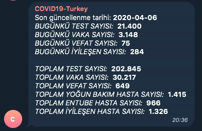

# COVID-19 Turkey API and Telegram Bot

Provides information about COVID-19 in Turkey.

- Gets data directly from [Republic of Turkey Ministry of Health COVID-19 website](https://covid19.saglik.gov.tr/).
- Checks the site every n (default is 300 in script) seconds, if anything changes in site sends message in Turkish via Telegram Bot API with provided API token and chat ID.
- Provides an API for today's data, total data and a timeseries dataset for cases and deaths for days.


**Telegram Message Screenshot**




## Setup

### Create your Telegram Bot

1. Create your bot and get your API token

   [Bots: An introduction for developers](https://core.telegram.org/bots#3-how-do-i-create-a-bot)

2. Add your bot to a group or start a private chat with your bot

3. Get chat_id from Telegram Bot API

   [Getting updates](https://core.telegram.org/bots/api#getting-updates)

   

### Run on a Docker container

1. Clone this repository

   ```bash
   git clone https://github.com/ykursadkaya/covidbot.git
   cd covidbot
   ```

2. Build Docker image

   ```bash
   docker build -t covidbot .
   ```

3. Run container

   ```bash
   docker run -p <external-port>:5000 --name <container-name> -e TELEGRAM_API_TOKEN=<api-token> -e TELEGRAM_CHAT_ID=<chat-id> covidbot
   ```


### Run directly on your machine

1. Install Python3

   [Python Download Page](https://www.python.org/downloads/)

2. Install pip for Python3

   [pip installation guide](https://pip.pypa.io/en/stable/installing/)

3. Clone this repository

   ```bash
   git clone https://github.com/ykursadkaya/covidbot.git
   cd covidbot
   ```

4. Install required Python packages

   ```bash
   pip3 install -r requirements.txt
   ```

5. Run [script](./covidbot.py)

   ```bash
   python3 covidbot.py
   ```


## API Documentation

### *Basic* Data

### Today Data

Use to get today's data.

**URL:** `/today/`

**Method:** `GET`

**Auth required:** No

#### Success Response

**Code:** `200 OK`

**Content example**

```json
{
    "case": "3.148",
    "death": "75",
    "lastUpdated": "2020-04-06",
    "recoveredPatient": "284",
    "test": "21.400"
}
```

#### Error Response

**Code:** `404 NOT FOUND`


### Total Data

Use to get total data.

**URL:** `/total/`

**Method:** `GET`

**Auth required:** No

#### Success Response

**Code:** `200 OK`

**Content example**

```json
{
    "case": "30.217",
    "death": "649",
    "icuPatient": "1.415",
    "intubatedPatient": "966",
    "lastUpdated": "2020-04-06",
    "recoveredPatient": "1.326",
    "test": "202.845"
}
```

#### Error Response

**Code:** `404 NOT FOUND`


### All Data

Use to get today and total data combined.

**URL:** `/all/`

**Method:** `GET`

**Auth required:** No

#### Success Response

**Code:** `200 OK`

**Content example**

```json
{
    "lastUpdated": "2020-04-06",
    "today": {
        "case": "3.148",
        "death": "75",
        "recoveredPatient": "284",
        "test": "21.400"
    },
    "total": {
        "case": "30.217",
        "death": "649",
        "icuPatient": "1.415",
        "intubatedPatient": "966",
        "recoveredPatient": "1.326",
        "test": "202.845"
    }
}
```

#### Error Response

**Code:** `404 NOT FOUND`


### All Data

Use to get today and total data combined.

**URL:** `/all/`

**Method:** `GET`

**Auth required:** No

#### Success Response

**Code:** `200 OK`

**Content example**

```json
{
    "lastUpdated": "2020-04-06",
    "today": {
        "case": "3.148",
        "death": "75",
        "recoveredPatient": "284",
        "test": "21.400"
    },
    "total": {
        "case": "30.217",
        "death": "649",
        "icuPatient": "1.415",
        "intubatedPatient": "966",
        "recoveredPatient": "1.326",
        "test": "202.845"
    }
}
```

#### Error Response

**Code:** `404 NOT FOUND`


### *Datasets*

### Cases Dataset

Use to get cases timeseries data for days.

**URL:** `/datasets/cases/`

**Method:** `GET`

**Auth required:** No

#### Success Response

**Code:** `200 OK`

**Content example**

```json
{
    "cases": [
        "1",
        "1",
        "1",
        "5",
        "6",
        "18",
        "47",
        "98",
        "191",
        "359",
        "670",
        "947",
        "1236",
        "1529",
        "1872",
        "2433",
        "3629",
        "5698",
        "7402",
        "9217",
        "10827",
        "13531",
        "15679",
        "18135",
        "20921",
        "23934",
        "27069",
        "30217"
    ],
    "dateLabels": [
        "10",
        "11",
        "12",
        "13",
        "14",
        "15",
        "16",
        "17",
        "18",
        "19",
        "20",
        "21",
        "22",
        "23",
        "24",
        "25",
        "26",
        "27",
        "28",
        "29",
        "30",
        "31",
        "1",
        "2",
        "3",
        "4",
        "5",
        "6",
        "7",
        "8"
    ],
    "dates": [
        "10 MARCH 2020",
        "11 MARCH 2020",
        "12 MARCH 2020",
        "13 MARCH 2020",
        "14 MARCH 2020",
        "15 MARCH 2020",
        "16 MARCH 2020",
        "17 MARCH 2020",
        "18 MARCH 2020",
        "19 MARCH 2020",
        "20 MARCH 2020",
        "21 MARCH 2020",
        "22 MARCH 2020",
        "23 MARCH 2020",
        "24 MARCH 2020",
        "25 MARCH 2020",
        "26 MARCH 2020",
        "27 MARCH 2020",
        "28 MARCH 2020",
        "29 MARCH 2020",
        "30 MARCH 2020",
        "31 MARCH 2020",
        "1 APRIL 2020",
        "2 APRIL 2020",
        "3 APRIL 2020",
        "4 APRIL 2020",
        "5 APRIL 2020",
        "6 APRIL 2020",
        "7 APRIL 2020",
        "8 APRIL 2020"
    ],
    "lastUpdated": "2020-04-06"
}
```

#### Error Response

**Code:** `404 NOT FOUND`


### Deaths Dataset

Use to get deaths timeseries data for days.

**URL:** `/datasets/deaths/`

**Method:** `GET`

**Auth required:** No

#### Success Response

**Code:** `200 OK`

**Content example**

```json
{
    "dateLabels": [
        "10",
        "11",
        "12",
        "13",
        "14",
        "15",
        "16",
        "17",
        "18",
        "19",
        "20",
        "21",
        "22",
        "23",
        "24",
        "25",
        "26",
        "27",
        "28",
        "29",
        "30",
        "31",
        "1",
        "2",
        "3",
        "4",
        "5",
        "6",
        "7",
        "8"
    ],
    "dates": [
        "10 MARCH 2020",
        "11 MARCH 2020",
        "12 MARCH 2020",
        "13 MARCH 2020",
        "14 MARCH 2020",
        "15 MARCH 2020",
        "16 MARCH 2020",
        "17 MARCH 2020",
        "18 MARCH 2020",
        "19 MARCH 2020",
        "20 MARCH 2020",
        "21 MARCH 2020",
        "22 MARCH 2020",
        "23 MARCH 2020",
        "24 MARCH 2020",
        "25 MARCH 2020",
        "26 MARCH 2020",
        "27 MARCH 2020",
        "28 MARCH 2020",
        "29 MARCH 2020",
        "30 MARCH 2020",
        "31 MARCH 2020",
        "1 APRIL 2020",
        "2 APRIL 2020",
        "3 APRIL 2020",
        "4 APRIL 2020",
        "5 APRIL 2020",
        "6 APRIL 2020",
        "7 APRIL 2020",
        "8 APRIL 2020"
    ],
    "deaths": [
        "0",
        "0",
        "0",
        "0",
        "0",
        "0",
        "0",
        "1",
        "2",
        "4",
        "9",
        "21",
        "30",
        "37",
        "44",
        "59",
        "75",
        "92",
        "108",
        "131",
        "168",
        "214",
        "277",
        "356",
        "425",
        "501",
        "574",
        "649"
    ],
    "lastUpdated": "2020-04-06"
}
```

#### Error Response

**Code:** `404 NOT FOUND`


### All Dataset

Use to get cases and deaths timeseries data combined for days.

**URL:** `/datasets/all/`

**Method:** `GET`

**Auth required:** No

#### Success Response

**Code:** `200 OK`

**Content example**

```json
{
    "cases": [
        "1",
        "1",
        "1",
        "5",
        "6",
        "18",
        "47",
        "98",
        "191",
        "359",
        "670",
        "947",
        "1236",
        "1529",
        "1872",
        "2433",
        "3629",
        "5698",
        "7402",
        "9217",
        "10827",
        "13531",
        "15679",
        "18135",
        "20921",
        "23934",
        "27069",
        "30217"
    ],
    "dateLabels": [
        "10",
        "11",
        "12",
        "13",
        "14",
        "15",
        "16",
        "17",
        "18",
        "19",
        "20",
        "21",
        "22",
        "23",
        "24",
        "25",
        "26",
        "27",
        "28",
        "29",
        "30",
        "31",
        "1",
        "2",
        "3",
        "4",
        "5",
        "6",
        "7",
        "8"
    ],
    "dates": [
        "10 MARCH 2020",
        "11 MARCH 2020",
        "12 MARCH 2020",
        "13 MARCH 2020",
        "14 MARCH 2020",
        "15 MARCH 2020",
        "16 MARCH 2020",
        "17 MARCH 2020",
        "18 MARCH 2020",
        "19 MARCH 2020",
        "20 MARCH 2020",
        "21 MARCH 2020",
        "22 MARCH 2020",
        "23 MARCH 2020",
        "24 MARCH 2020",
        "25 MARCH 2020",
        "26 MARCH 2020",
        "27 MARCH 2020",
        "28 MARCH 2020",
        "29 MARCH 2020",
        "30 MARCH 2020",
        "31 MARCH 2020",
        "1 APRIL 2020",
        "2 APRIL 2020",
        "3 APRIL 2020",
        "4 APRIL 2020",
        "5 APRIL 2020",
        "6 APRIL 2020",
        "7 APRIL 2020",
        "8 APRIL 2020"
    ],
    "deaths": [
        "0",
        "0",
        "0",
        "0",
        "0",
        "0",
        "0",
        "1",
        "2",
        "4",
        "9",
        "21",
        "30",
        "37",
        "44",
        "59",
        "75",
        "92",
        "108",
        "131",
        "168",
        "214",
        "277",
        "356",
        "425",
        "501",
        "574",
        "649"
    ],
    "lastUpdated": "2020-04-06"
}
```

#### Error Response

**Code:** `404 NOT FOUND`


